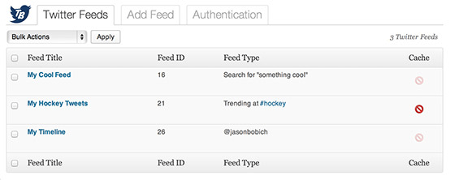
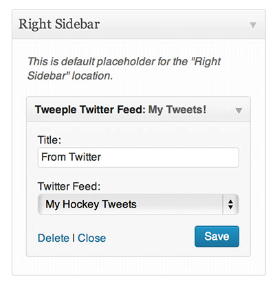
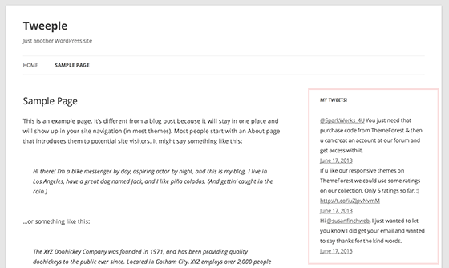
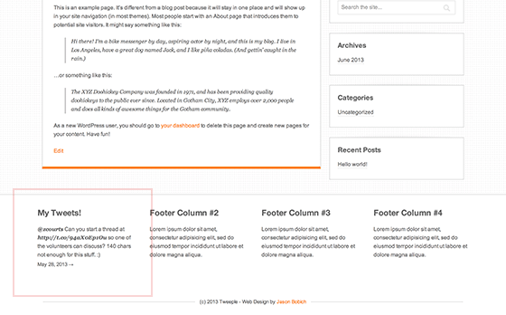

=== Tweeple ===

Author URI: http://www.themeblvd.com
Contributors: themeblvd
Tags: twitter, api, status, tweets, list, favorites, tmhOAuth, Theme Blvd, themeblvd, Jason Bobich
Stable Tag: 0.9.2

Setup Twitter feeds to pull a user's public timeline, public list, favorite tweets, or a custom search term, phrase, or hashtag.

== Description ==

For all you fellow tweeple, this is the plugin for you. Sure, there are tons of Twitter WordPress plugins already out there, but Tweeple gives you a more [ThemeBlvd](http://themeblvd.com)-ish approach to things.

*Note: This plugin does NOT require a theme with Theme Blvd framework. This is a plugin for all tweeple!*

= How it works =

**Authentication**: After setting up your credentials with Twitter API -- [see FAQ](http://wordpress.org/plugins/tweeple/faq/) -- you can utilize Tweeple to pull from Twitter API for your WordPress website.

**Twitter Feeds**: You can setup as many Twitter Feeds on your site as you want, and manage them all from one location at *WP Admin > Tools > Tweeple*. A Twitter feed can be configured to pull a Twitter user's public timeline, public list, favorite tweets, or a custom search term, phrase, or hashtag.

**Implementation**: You can display any of your Twitter feeds on your website via the "Tweeple Twitter Feed" widget or the `[tweeple_feed]` shortcode. -- [See Usage Instructions](http://wordpress.org/plugins/tweeple/installation/).

= Contributing =

Tweeple is a free plugin for everyone. If you find bugs, or have suggestions, please don't hesitate to post in our official Tweeple repo on Github.

[https://github.com/themeblvd/Tweeple](https://github.com/themeblvd/Tweeple)

= A note to Theme Blvd customers =

If you're currently using a Theme Blvd theme, you probably noticed that the Theme Blvd Twitter widget included no longer works, as of June 2013, because of changes to Twitter's API system. We apologize for this inconvenience.

If you'd like to keep our Twitter functionality, you'll want to use this plugin as a replacement. Using this plugin's "Tweeple Twitter Feed" widget with your current Theme Blvd theme should give you an almost identical result on the frontend of your website as the old widget gave you.

*Note: As future theme updates come out, you will see that we've moved much of the theme's functionality like [custom layouts](http://wordpress.org/plugins/theme-blvd-layout-builder/), [sliders](http://wordpress.org/plugins/theme-blvd-sliders/), [shortcodes](http://wordpress.org/plugins/theme-blvd-shortcodes/), [widgets](http://wordpress.org/plugins/theme-blvd-widget-pack/), etc, to plugins, and the Twitter functionality is no different. So Tweeple will hopefully be your answer, moving forward, as we roll things along.*

= Credits =

* [tmhOAuth](https://github.com/themattharris/tmhOAuth), An OAuth 1.0A library written in PHP. By [Matt Harris](https://twitter.com/themattharris).

== Installation ==

1. Upload `tweeple` folder to the `/wp-content/plugins/` directory
2. Activate the plugin through the 'Plugins' menu in WordPress
3. Go to *Tools > Tweeple* to setup loklak API or your Twitter API authentication and mange your Twitter feeds.

*NOTE: This plugin does NOT require a theme with Theme Blvd framework. This is a plugin for all tweeple!*

= Usage =

Once you've setup your Twitter API authentication settings ([see FAQ](http://wordpress.org/plugins/tweeple/faq/)), and created a Twitter feed, there are two ways to display a Twitter feed on the frontend of your website.

1. Shortcode: You can use the `[tweeple_feed]` shortcode like this: `[tweeple_feed id="123"]`
2. Widget: From *Appearance > Widgets*, use the "Tweeple Twitter Feed" widget in one of your sidebars.

== Frequently Asked Questions ==

= What are "Authentication" settings? =

This is sort of a pain, but as of June 2013, in order to access Twitter API from your website, you need to setup credentials with Twitter. The general concept is that you'll need to create what Twitter calls a "developer application."

Think of your WordPress website as the "application" -- Once you have these credentials setup for your site, you'll have full access to use Tweeple to pull from Twitter API.

= How do I setup the "Authentication" settings? =

[vimeo https://vimeo.com/68603403]

After installing Tweeple, in your WordPress admin, go to *Tools > Tweeple > Authentication* and you'll find your Twitter API application settings.

To create your "application," login to Twitter, and go to: [https://dev.twitter.com/apps](https://dev.twitter.com/apps)

Create an application, and then create a user token for that application.

After you're done, you'll need to put in the following information to Tweeple at *WP Admin > Tools > Tweeple > Authentication*:

* API key — *formerly “Consumer key”*
* API secret — *formerly “Consumer secret”*
* Access token
* Access secret

= Does it matter what account I setup my Twitter developer application under? =

Nope. The Twitter account you create your developer application with doesn't really matter. Once you have your authorization credentials setup, you'll be able to use Tweeple to pull tweets from any public Twitter account, list, or search.

= I posted to Twitter, but it's not showing up on my website right away. What gives? =

This is because of caching. Tweeple stores the information retrieved from Twitter in your WordPress database for a certain amount of time, before going back to Twitter to update the information.

= Why does Tweeple use caching? =

In the process of pulling from Twitter API for your website, caching is crucial. It is a big process for your web server to go out and pull from Twitter. So, you don't want Tweeple pulling from Twitter every time someone visits your website.

Additionally, Twitter API has [rate limits](https://dev.twitter.com/docs/rate-limiting/1.1/limits). So, in theory, if you had consistent traffic coming to your website and your server *could* handle pulling from Twitter on every page load without exploding, Twitter API would keep cutting your server's IP address off.

= Can I manually clear a Twitter feed's cache? =

Yup! Let's say you've just posted a breaking Tweet that's really important and you want your website visitors to see it right away. --

Just go to *WP Admin > Tools > Tweeple > Twitter Feeds* and click the button to clear a specific Twitter feed's cache. After this, the next visitor to your website will trigger Tweeple to go out to Twitter and pull the latest tweets to be stored in the cache again.

Also note that any time you update a Twitter feed's settings, the feed's cache is cleared automatically.

= Can I change how long Twitter feeds are cached for? =

Yup. When editing any Twitter feed at *WP Admin > Tools > Tweeple*, you can change the cache time seconds under "Performance."

Our recommended, and default, setting for this is 7200 seconds (i.e. 2 hours).

Note: We have safeguard implemented that does not allow you to set this less than 60 seconds. If you're a developer and you know what you're doing, you can change this limit with the filter "tweeple_cache_time_minimum".

== Screenshots ==

1. Manage the Twitter feeds you've created.

	

2. Edit a Twitter feed.

	

3. Grab your application credentials from dev.twitter.com and put them in the plugin's Authorization settings.

	

4. Use the "Tweeple Twitter Feed" widget to display tweets in one of your widget areas.

	

5. Should fit naturally into most themes with no frontend styling added by the plugin.

	

6. If you're using a Theme Blvd theme, the widget will integrate as your old Theme Blvd Twitter widget did.
	
	

== Changelog ==

= 0.9.2 =

* Changed wording in admin to reflect new Twitter verbiage "API key" and "API secret" which were formerly "Consumer key" and "Consumer secret".
* Added support for multiple feeds in shortcode. Ex: `[tweeple_feed id="1,2,3"]`
* Further improvements to support for international characters.

= 0.9.1 =

* Fixed Twitter icon for Recent Tweet element added to Layout Builder.

= 0.9.0 =

* Admin style changes for WordPress 3.8+

= 0.8.0 =

* Added option to control UTF-8 encoding on Twitter Feeds.

= 0.7.0 =

* Fixed issues where cache would return 'a' instead of list of tweets when a non unicode character is in a tweet. (props @nielsvr)

= 0.6.0 =

* Fixed "Exclude @replies" bug that resulted from 0.5 update.

= 0.5.0 =

* **Clear your Twitter feed caches, at Tools > Tweeple > Twitter Feeds, after this update.**
* Separated out "Tweet Display Limit" with new "Raw Tweet Count" performance option for number of Tweets. -- So, if you're excluding retweets or @replies, you'll want your raw Tweet count to be higher than your display limit.
* Expanded cached feeds to include `retweet_count`, `favorite_count`, `source`, and `lang` for your custom templating.
* Added `tweeple_do_entities` boolean filter for advanced users to add entities to feeds for custom templating.
* Fixed `#hashtag` links in Tweets not linking correctly to Twitter search.
* Tweet "Time" in admin is now "Details" for better referencing.
* Action hook `tweeple_tweet_time` changed to `tweeple_tweet_meta` and hooked functions also use term "meta" instead of "time".
* Started library of helper functions that can be used for templating -- See */inc/functions.php*
* Developers can now merge multiple Twitter feeds, keeping Tweets all arranged chronilogically. -- [See code example](https://github.com/themeblvd/Tweeple/wiki/Merging-multiple-Twitter-feeds)
* Fixed "Tweet" element from last update in Theme Blvd framework v2-2.2.
* Minor improvements to error handling for end-user when fetching from Twitter.
* Minor improvements to Add/Edit Twitter feeds form.

= 0.4.0 =

* Added support for "Tweet" Builder element in Theme Blvd themes.

= 0.3.0 =

* Fixed CSS quirk with "Twitter Feeds" admin interface in Firefox.

= 0.2.0 =

* Improved saving and handling notices for Authentication settings page.

= 0.1.0 =

* This is the first release.